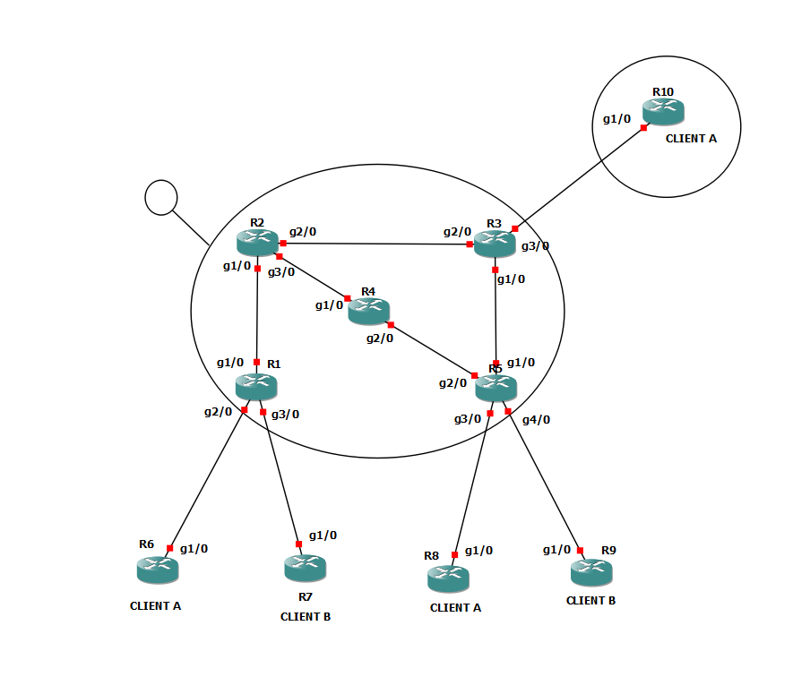

Projet NAS : Zhuangyi Chen, Louise Marc, Anne-Gaëlle Mauger, Nelly Nguyen, Zixin Peng (3TC2)

# Fonctionnalités du projet

Automatisation IPv4 (et IPv6, conservé par rapport au projet GNS3) par rapport au fichier intend _data_extend.json_ pour :
- adressage automatique IPv4
- OSPF v2 sur les Loopback et les interfaces intérieures au réseau de coeur
- MPLS LDP
- BGP/MPLS VPN sur les Loopback
- VRF et eBGP sur les interfaces reliées aux clients

# Fichier GNS3

Le fichier GNS3 se trouve dans _NAS_GNS3.zip_. Ci-dessous l'aspect du réseau :

